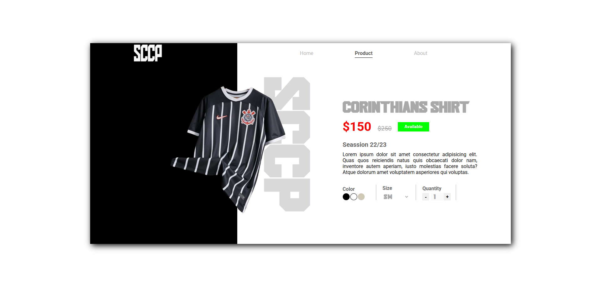

# 👕 Corinthians Shirt Product Page

**Corinthians Shirt Product Page** is a static landing page built with **ReactJS** and **Tailwind CSS** that simulates an e-commerce product detail page for a Corinthians football jersey. The main focus of the project is component layout and visual structure — responsiveness was not implemented.

## 📸 Project Preview

  

## 🚀 Project Overview

This application presents a simple product page layout including:

- Product image
- Title and description
- Price
- Size options (UI only)
- Quantity selector
- Add to cart (simulated)

> ⚠️ **Note:** This project is **not responsive** and was built as a layout and styling exercise.

## 🌟 Features

- 🖼️ **Static Product Page Layout**  
  Fixed layout with visual emphasis on component structure.

- 📏 **Size and Quantity Options**  
  UI components that simulate typical product selections.

- 🛒 **Add to Cart Simulation**  
  Basic interactive button without full e-commerce logic.

## 🛠️ Technologies Used

- **ReactJS** – JavaScript library for building user interfaces
- **CSS Module** – Utility-first CSS framework for UI styling
- **Vite** – Fast development build tool

## 📚 Learning Objectives

This project was created to:

- Practice building UI components with React
- Explore CSS Module styling techniques
- Simulate the structure of a real product detail page
- Improve visual layout and styling without responsiveness

## 🌐 Live Demo

View the live site:  
👉 [corinthians-shirt-product-page.vercel.app](https://corinthians-shirt-product-page.vercel.app/)

## 📄 License

This project is intended for educational and demonstrative purposes only.  
All content is fictional and does not represent any real brand or commercial product.

---
